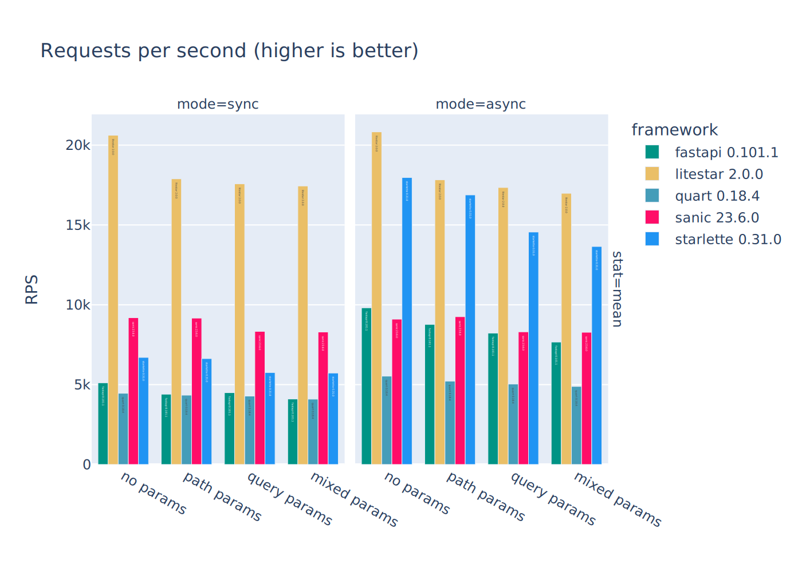

# Benchmarks

## Methodology

- Benchmarking is done using the [bomardier](https://github.com/codesenberg/bombardier) benchmarking tool.
- Benchmarks are run on a dedicated machine, with a base Debian 11 installation.
- Each framework is contained within its own docker container, running on a dedicated CPU core (using the `cset shield` command the `--cpuset-cpus` option for docker)
- Tests for the frameworks are written to make them as comparable as possible while completing the same tasks (you can see them [here](https://github.com/starlite-api/api-performance-tests/tree/main/frameworks))
- Each application is run using [uvicorn](https://www.uvicorn.org/) with **one worker** and [uvloop](https://uvloop.readthedocs.io/)
- Test data has been randomly generated and is being imported from a shared module

## Results

!!! info
    If a result is missing for a specific framework that means either

    - It does not support this functionality (this will be mentioned in the test description)
    - More than 0.1% of responses were dropped / erroneous

### JSON

Serializing a d
ictionary into JSON

### Files

### Path and query parameter handling

_All responses return "No Content"_

- No params: No path parameters
- Path params: Single path parameter, coerced into an integer
- Query params: Single query parameter, coerced into an integer
- Mixed params: A path and a query parameters, coerced into integers

### Dependency injection

<small>_(not supported by `Starlette`)_</small>

- Resolving 3 nested synchronous dependencies
- Resolving 3 nested asynchronous dependencies (only supported by `Starlite` and `FastAPI`)
- Resolving 3 nested synchronous, and 3 nested asynchronous dependencies (only supported by `Starlite` and `FastAPI`)

### Modifying responses

_All responses return "No Content"_

### Plaintext

## Interpreting the results

An interpretation of these results should be approached with caution, as is the case
for nearly all benchmarks. A high score in a test does not necessarily translate to
high performance of **your** application in **your** use case. For almost any test
you can probably write an app that performs better or worse at a comparable task
**in your scenario**.

While trying to design the tests in a way that simulate somewhat realistic scenarios,
they can never give an exact representation of how a real world application, where,
aside from the workload, many other factors come into play. These tests were mainly written
to be used internally for starlite development, to help us locate the source of some
performance regression we were experiencing.
